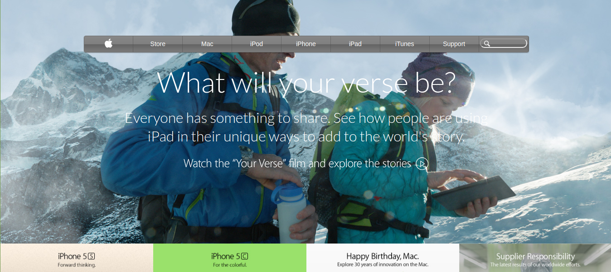

# Project: Apple 2014 Clone

This is the project of the Main HTML/CSS curriculum at [Microverse](https://www.microverse.org/)
This assignment consists of making a clone of a [Apple webiste 2014 ](https://web.archive.org/web/20140301004610/http://www.apple.com/)
Read more about the project detailed description from the [Odin website](https://www.theodinproject.com/courses/html5-and-css3/lessons/building-with-backgrounds-and-gradients).

## Project Objectives

- Application of gradient backgrounds
- Alligning elements with flex display
- Positioning with relative and absolute

### [Assingment Link](https://www.theodinproject.com/courses/html5-and-css3/lessons/building-with-backgrounds-and-gradients)

### [Live link](https://rawcdn.githack.com/OlukaDenis/Apple-Clone/b48760e8c8391405f512d89738dbbc5a074aac61/index.html)

# Languages Used

- HTML
- CSS

# Contributing

If you are working on adding features, PRs, or bugfixes, this section should help get you going.

1. Fork it
2. Create your feature branch
   > `git checkout -b 'your-feature-branch'`
3. Commit your changes
   > `git commit -am 'Add some feature'`
4. Push to the branch
   > `git push origin 'my-feature-branch'`
5. Create new Pull Request

# Screenshot

# Author

- [Denis Oluka](https://github.com/OlukaDenis)
